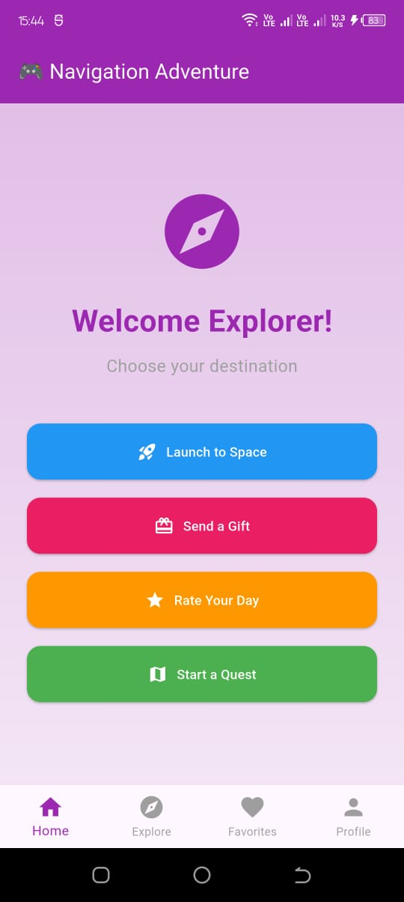
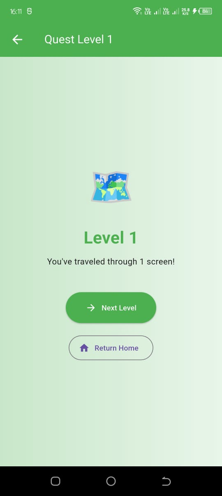
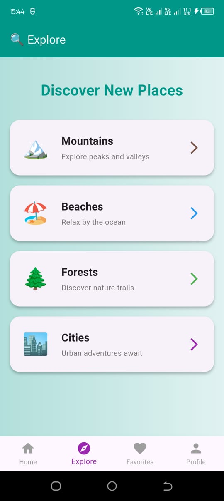
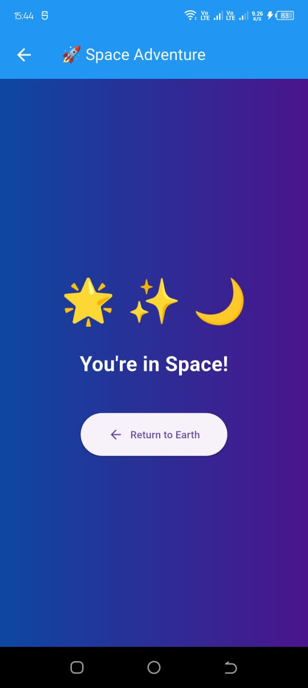
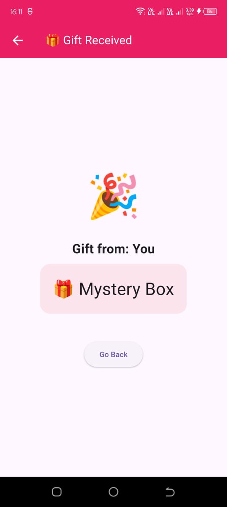
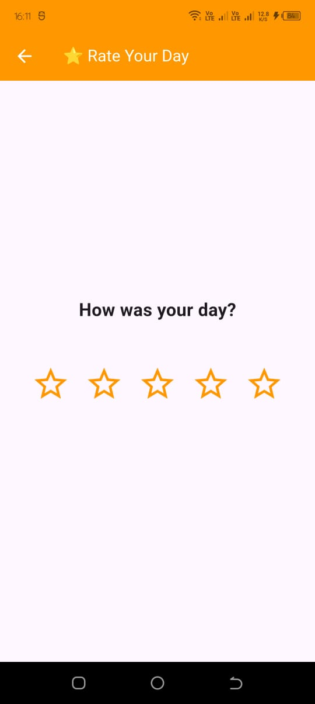
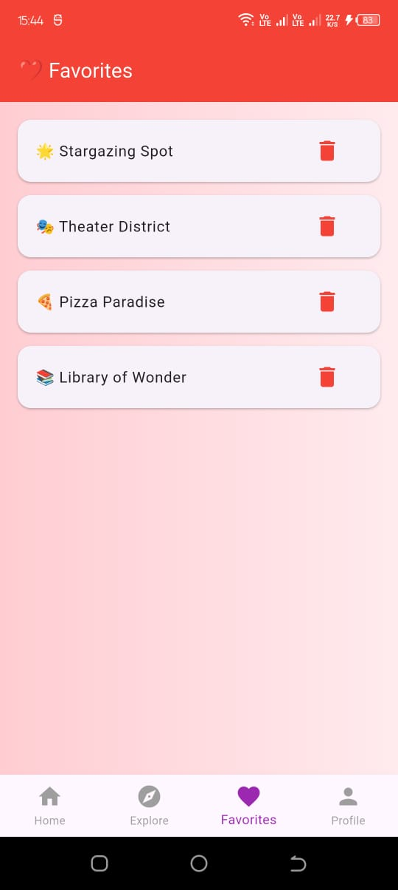
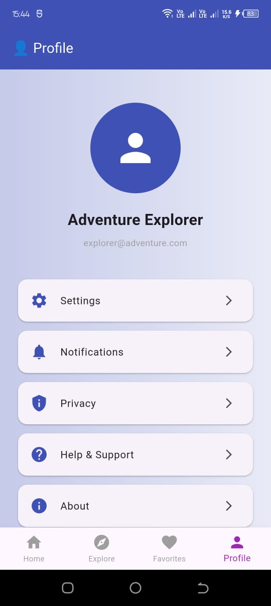

# 05 - Navigation: Moving Between Screens

## 🎯 What You'll Learn
- How to navigate between different screens
- Using Bottom Navigation Bar for tab-based navigation
- Passing data to new screens
- Getting data back from screens
- Understanding the navigation stack
- Multiple navigation patterns

---

## 📱 App Screenshots

### Main Features

*The main home screen with navigation options*


*Bottom navigation bar showing all tabs*

### Navigation Examples

*Explore tab with discoverable places*


*Simple push navigation example*


*Receiving data from previous screen*


*Interactive rating and returning data*


*Multi-level navigation example*

### Bottom Navigation Tabs
| Home | Explore | Favorites | Profile |
|------|---------|-----------|---------|
|  |  |  |  |

---

## 🏗️ App Structure

The app demonstrates two main navigation patterns:

### 1. Bottom Navigation Bar (Tab-Based)
- **Home Tab** - Main hub with various navigation demonstrations
- **Explore Tab** - Discoverable places with detail pages
- **Favorites Tab** - Stateful list management
- **Profile Tab** - User information and settings

### 2. Stack Navigation (Push/Pop)
- Simple navigation (Space Page)
- Passing data (Gift Page)
- Returning data (Rating Page)
- Multi-level navigation (Quest Pages)

---

## 🚀 The Navigator Stack

Think of navigation like a **stack of cards**:
- Each screen is a card
- `push()` adds a new card on top
- `pop()` removes the top card
- You always see the top card (current screen)

```
[Home Screen]              <- Bottom of stack
[Space Screen]             <- Middle
[Gift Screen]              <- Top (visible)
```

---

## 🎮 Navigation Patterns in This App

### 1️⃣ Bottom Navigation Bar

**Setup:**
```dart
class MainNavigationPage extends StatefulWidget {
  @override
  State<MainNavigationPage> createState() => _MainNavigationPageState();
}

class _MainNavigationPageState extends State<MainNavigationPage> {
  int _currentIndex = 0;
  
  final List<Widget> _pages = [
    const HomePage(),
    const ExploreTab(),
    const FavoritesTab(),
    const ProfileTab(),
  ];

  @override
  Widget build(BuildContext context) {
    return Scaffold(
      body: _pages[_currentIndex],
      bottomNavigationBar: BottomNavigationBar(
        currentIndex: _currentIndex,
        onTap: (index) {
          setState(() {
            _currentIndex = index;
          });
        },
        items: const [
          BottomNavigationBarItem(icon: Icon(Icons.home), label: 'Home'),
          BottomNavigationBarItem(icon: Icon(Icons.explore), label: 'Explore'),
          BottomNavigationBarItem(icon: Icon(Icons.favorite), label: 'Favorites'),
          BottomNavigationBarItem(icon: Icon(Icons.person), label: 'Profile'),
        ],
      ),
    );
  }
}
```

**When to use:** Apps with 3-5 main sections that users switch between frequently

---

### 2️⃣ Simple Push Navigation

**Going Forward:**
```dart
Navigator.push(
  context,
  MaterialPageRoute(
    builder: (context) => const SpacePage(),
  ),
);
```

**Going Back:**
```dart
Navigator.pop(context);
```

**When to use:** Basic navigation between screens

**Example in app:** Home → Space Page (🚀 Launch to Space button)

---

### 3️⃣ Passing Data to a Screen

**Sending data:**
```dart
Navigator.push(
  context,
  MaterialPageRoute(
    builder: (context) => const GiftPage(
      senderName: 'You',
      giftType: '🎁 Mystery Box',
    ),
  ),
);
```

**Receiving data in the new screen:**
```dart
class GiftPage extends StatelessWidget {
  final String senderName;
  final String giftType;

  const GiftPage({
    super.key,
    required this.senderName,
    required this.giftType,
  });
  
  @override
  Widget build(BuildContext context) {
    // Now you can use senderName and giftType!
    return Scaffold(
      body: Center(
        child: Column(
          children: [
            Text('Gift from: $senderName'),
            Text(giftType),
          ],
        ),
      ),
    );
  }
}
```

**When to use:** When the next screen needs information from the current screen

**Example in app:** Home → Gift Page (🎁 Send a Gift button)

---

### 4️⃣ Getting Data Back (Async Navigation)

**Navigating and waiting for result:**
```dart
final result = await Navigator.push(
  context,
  MaterialPageRoute(
    builder: (context) => const RatingPage(),
  ),
);

// Check if widget is still mounted before using context
if (context.mounted && result != null) {
  ScaffoldMessenger.of(context).showSnackBar(
    SnackBar(content: Text('You rated your day: $result ⭐')),
  );
}
```

**Returning data from the screen:**
```dart
// In RatingPage
Navigator.pop(context, _selectedRating);
```

**When to use:** Forms, selections, or when you need user input from another screen

**Example in app:** Home → Rating Page (⭐ Rate Your Day button)

---

### 5️⃣ Multi-Level Navigation

**Navigating through multiple screens:**
```dart
Navigator.push(
  context,
  MaterialPageRoute(
    builder: (context) => QuestPage(level: level + 1),
  ),
);
```

**Going back to the first screen:**
```dart
Navigator.popUntil(context, (route) => route.isFirst);
```

**When to use:** Wizards, multi-step forms, or progressive experiences

**Example in app:** Quest Pages (🗺️ Start a Quest button) - Navigate through Level 1, 2, and 3

---

### 6️⃣ List-Based Navigation

**From Explore Tab to Detail Pages:**
```dart
InkWell(
  onTap: () {
    Navigator.push(
      context,
      MaterialPageRoute(
        builder: (context) => DetailPage(
          emoji: emoji,
          title: title,
          subtitle: subtitle,
          color: color,
        ),
      ),
    );
  },
  child: ListTile(...),
)
```

**When to use:** Displaying a list where each item opens a detail page

**Example in app:** Explore Tab → Mountains/Beaches/Forests/Cities detail pages

---

## 🎨 Key Concepts Explained

### MaterialPageRoute
This creates the transition animation between screens:
```dart
MaterialPageRoute(
  builder: (context) => const YourPage(),
)
```
- The `builder` function returns your widget
- It automatically handles the "slide from right" animation
- The back button is added automatically to the AppBar

### Bottom Navigation vs Stack Navigation

**Bottom Navigation:**
- Tabs persist across the app
- Quick access to main sections
- All pages are kept in memory
- Perfect for apps like Instagram, Twitter, etc.

**Stack Navigation:**
- Hierarchical flow (detail pages, forms, etc.)
- Uses device back button
- Memory efficient (only visible screens loaded)
- Perfect for drill-down content

### The Context Parameter
```dart
Navigator.push(context, ...)
```
- `context` tells Flutter where you are in the widget tree
- It's needed to know which screen to navigate from
- Always passed automatically to `build()` methods

### Async/Await with Context
```dart
final result = await Navigator.push(...);
if (context.mounted) {
  // Safe to use context here
  ScaffoldMessenger.of(context).showSnackBar(...);
}
```
- `await` means "wait for this to finish"
- Always check `context.mounted` after async operations
- Navigation returns data when the screen is popped

---

## 🎯 Practice Exercises

### 🟢 Beginner Challenges

#### Challenge 1: Add a New Tab
Add a fifth tab to the bottom navigation:
- Icon: `Icons.music_note`
- Label: 'Music'
- Shows a list of favorite songs
- Each song can be tapped to show a detail page

**Hint:** Follow the pattern of ExploreTab!

#### Challenge 2: Profile Editor
On the Profile tab, add an "Edit Profile" button that:
- Opens a new screen with text fields
- Returns the updated name and email
- Updates the profile display

**Hint:** Look at how RatingPage returns data!

---

### 🟡 Intermediate Challenges

#### Challenge 3: Enhanced Favorites
Improve the Favorites tab:
1. Add a "+" floating action button
2. Opens a screen to add new favorites
3. Let users choose from categories (🌟 Places, 🎭 Events, 🍕 Food)
4. Show category icons in the favorites list

**Bonus:** Add search functionality to filter favorites!

#### Challenge 4: Explore with Filters
Enhance the Explore tab:
1. Add a filter button in the AppBar
2. Opens a screen with checkbox filters:
   - Nature (Mountains, Forests)
   - Urban (Cities)
   - Relaxation (Beaches)
3. Apply filters to show only matching places
4. Show active filter count on the filter button

**Hint:** Use stateful widgets and pass filter data!

---

### 🔴 Advanced Challenges

#### Challenge 5: Complete Settings Page
Build a full settings system:
1. Profile tab → Settings opens a new screen
2. Settings has these options:
   - Notifications (toggle on/off)
   - Theme (Light/Dark/System)
   - Language (English/Spanish/French)
3. Each setting opens its own screen
4. Save preferences and show them on Profile

**Hint:** You'll need state management across screens!

#### Challenge 6: Quest with Choices
Enhance the Quest system:
1. At each level, give 2 path choices
2. Each path leads to different next levels
3. Track the path taken
4. Show a summary at the end with the complete journey
5. Add a "Try Different Path" button to restart

**Super bonus:** Add collectible items at each level and show total collected!

---

## 🎪 Fun Mini-Project: Travel Planner

Create a travel planning app combining both navigation types:

**Bottom Navigation:**
1. **Destinations Tab:** List of places to visit
2. **Itinerary Tab:** Planned trips
3. **Favorites Tab:** Saved destinations
4. **Profile Tab:** User info and settings

**Stack Navigation:**
- Tap destination → Detail page with images and info
- Add to trip → Opens itinerary builder
- Multiple days → Swipe through days
- Booking → Multi-step form

**Features to add:**
- Pass destination data to detail pages
- Return booking confirmation to itinerary
- Navigate through multi-day plans
- Save favorites with categories
- Settings for currency and language

---

## 💡 Pro Tips

### ✅ DO:
- Use meaningful names for your screens (HomePage, ProfilePage, etc.)
- Always check `context.mounted` after async operations
- Use `const` constructors when possible for better performance
- Provide meaningful back button labels
- Handle deep navigation with `popUntil()`
- Keep bottom nav items between 3-5 for usability

### ❌ DON'T:
- Don't forget to check if widget is mounted before showing SnackBars after async navigation
- Don't create circular navigation (A → B → A → B...)
- Don't forget to pass required parameters
- Don't pop when you're already at the first screen
- Don't use bottom nav for more than 5 items
- Don't navigate to new screens from bottom nav (use stack navigation instead)

---

## 🐛 Common Mistakes & Fixes

### Mistake 1: Context after async without checking mounted
```dart
// ❌ Error: Context might be invalid
final result = await Navigator.push(...);
ScaffoldMessenger.of(context).showSnackBar(...);

// ✅ Correct
final result = await Navigator.push(...);
if (context.mounted) {
  ScaffoldMessenger.of(context).showSnackBar(...);
}
```

### Mistake 2: Forgetting required parameters
```dart
// ❌ Error: parameters required
Navigator.push(
  context,
  MaterialPageRoute(builder: (context) => GiftPage()),
);

// ✅ Correct
Navigator.push(
  context,
  MaterialPageRoute(
    builder: (context) => GiftPage(
      senderName: 'John',
      giftType: '🎁',
    ),
  ),
);
```

### Mistake 3: Too many setState calls in bottom nav
```dart
// ❌ Creates unnecessary rebuilds
onTap: (index) {
  setState(() {
    _currentIndex = index;
  });
  setState(() {
    _someOtherValue = something;
  });
}

// ✅ Combine into one setState
onTap: (index) {
  setState(() {
    _currentIndex = index;
    _someOtherValue = something;
  });
}
```

### Mistake 4: Trying to pop the first screen
```dart
// ❌ Nothing to pop!
Navigator.pop(context); // On the first screen

// ✅ Check first
if (Navigator.canPop(context)) {
  Navigator.pop(context);
}
```

---

## 🎓 Testing Your Understanding

Try to answer these questions:

1. What's the difference between bottom navigation and stack navigation?
2. When should you use `Navigator.push()` vs switching bottom nav tabs?
3. How do you send data to a new screen?
4. What does `await` do in navigation?
5. Why do we check `context.mounted` after async operations?
6. How do you go back multiple screens at once?
7. What's the maximum recommended number of bottom nav items?

<details>
<summary>Click to see answers</summary>

1. Bottom nav switches between main app sections (flat hierarchy), stack nav is for drill-down content (hierarchical)
2. Use bottom nav for main sections users switch between frequently; use push for detail pages and forms
3. Pass parameters to the screen's constructor
4. It waits for the screen to be popped and returns any data
5. After async operations, the widget might be unmounted, so check before using context
6. Use `Navigator.popUntil(context, (route) => route.isFirst)`
7. Between 3-5 items for best usability

</details>

---

## 🎮 Quick Reference

### Stack Navigation
```dart
// Go to new screen
Navigator.push(context, MaterialPageRoute(builder: (context) => NewPage()));

// Go back
Navigator.pop(context);

// Go back with data
Navigator.pop(context, myData);

// Go back to home
Navigator.popUntil(context, (route) => route.isFirst);

// Replace current screen
Navigator.pushReplacement(context, MaterialPageRoute(builder: (context) => NewPage()));

// Get data back
final result = await Navigator.push(...);
if (context.mounted) {
  // Use result safely
}
```

### Bottom Navigation
```dart
// In StatefulWidget
int _currentIndex = 0;
final List<Widget> _pages = [Page1(), Page2(), Page3()];

BottomNavigationBar(
  currentIndex: _currentIndex,
  onTap: (index) => setState(() => _currentIndex = index),
  items: [
    BottomNavigationBarItem(icon: Icon(Icons.home), label: 'Home'),
    // ... more items
  ],
)

// Display current page
body: _pages[_currentIndex]
```

---

## 📚 What's Next?

Now that you master both bottom navigation and stack navigation, you're ready for:
- **Forms & Input**: Text fields, buttons, validation
- **State Management**: Managing data across tabs and screens
- **Advanced Navigation**: Named routes, route guards
- **Animations**: Custom page transitions

---

## 🎉 Achievement Unlocked!

Once you complete the practice exercises, you'll understand:
- ✅ How to implement bottom navigation
- ✅ How to move between screens with stack navigation
- ✅ When to use each navigation pattern
- ✅ How to pass data between screens
- ✅ How to handle user selections and returns
- ✅ How to build complex multi-screen apps

**Keep building! The best way to learn is by creating your own projects!** 🚀

---

## 📁 Project Structure

```
lib/
├── main.dart
│   ├── MyApp (MaterialApp setup)
│   ├── MainNavigationPage (Bottom Navigation)
│   │
│   ├── Bottom Nav Tabs:
│   │   ├── HomePage (Home tab with navigation examples)
│   │   ├── ExploreTab (Explore tab with list navigation)
│   │   ├── FavoritesTab (Stateful favorites list)
│   │   └── ProfileTab (Profile information)
│   │
│   ├── Stack Navigation Screens:
│   │   ├── SpacePage (Simple navigation example)
│   │   ├── GiftPage (Receiving data example)
│   │   ├── RatingPage (Returning data example)
│   │   ├── QuestPage (Multi-level navigation)
│   │   └── DetailPage (Explore detail pages)
│   │
│   └── Reusable Components:
│       └── NavigationButton (Custom button widget)
```

---

## 🔗 Resources
- [Flutter Navigation Docs](https://flutter.dev/docs/cookbook/navigation)
- [Navigator Class](https://api.flutter.dev/flutter/widgets/Navigator-class.html)
- [Bottom Navigation Bar](https://api.flutter.dev/flutter/material/BottomNavigationBar-class.html)
- [Routes and Navigation Guide](https://docs.flutter.dev/ui/navigation)
- [Material Design - Bottom Navigation](https://m3.material.io/components/navigation-bar/overview)

---

### 📸 Adding Screenshots

To add screenshots to this README:

1. Run your app and take screenshots of each screen
2. Create a `screenshots` folder in your project root
3. Save screenshots with these names:
   - `home_screen.png`
   - `bottom_nav.png`
   - `explore_tab.png`
   - `space_page.png`
   - `gift_page.png`
   - `rating_page.png`
   - `quest_flow.png`
   - `tab_home.png`, `tab_explore.png`, `tab_favorites.png`, `tab_profile.png`
4. The README will automatically display them!

**Tip:** Use a phone simulator for consistent screenshot sizes (iPhone 14 or Pixel 7 recommended)